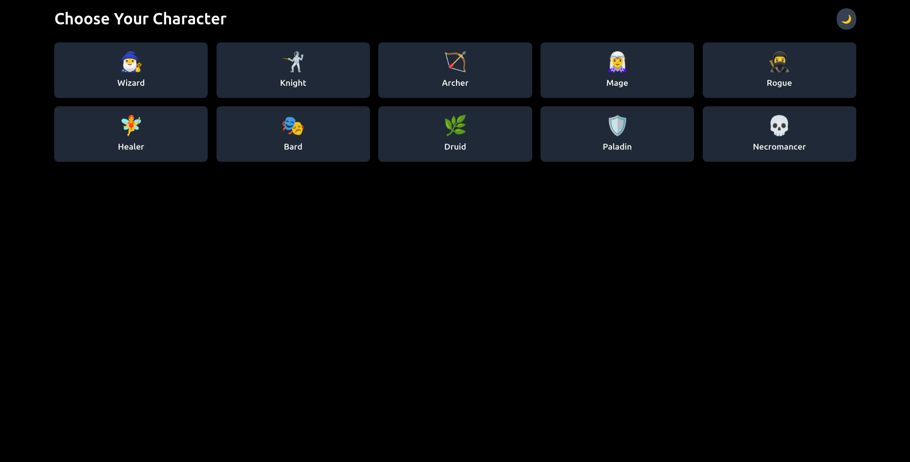

# Chatter

Chatter is a real-time chat application built with SvelteKit and Neon Database. It allows users to post messages, reply to messages, and react to messages with emojis.

## Live Demo

Check out the live demo [here](https://chatter.ifsvivek.tech)

## UI

## Features

- **Real-time Messaging**: Post and receive messages in real-time.
- **Replies**: Reply to specific messages.
- **Reactions**: React to messages with emojis.
- **Dark Mode**: Supports dark mode for better user experience.

## Technologies Used

- **Frontend**: SvelteKit
- **Backend**: Neon Database
- **Styling**: TailwindCSS
- **Build Tool**: Vite
- **Linting**: ESLint
- **Formatting**: Prettier