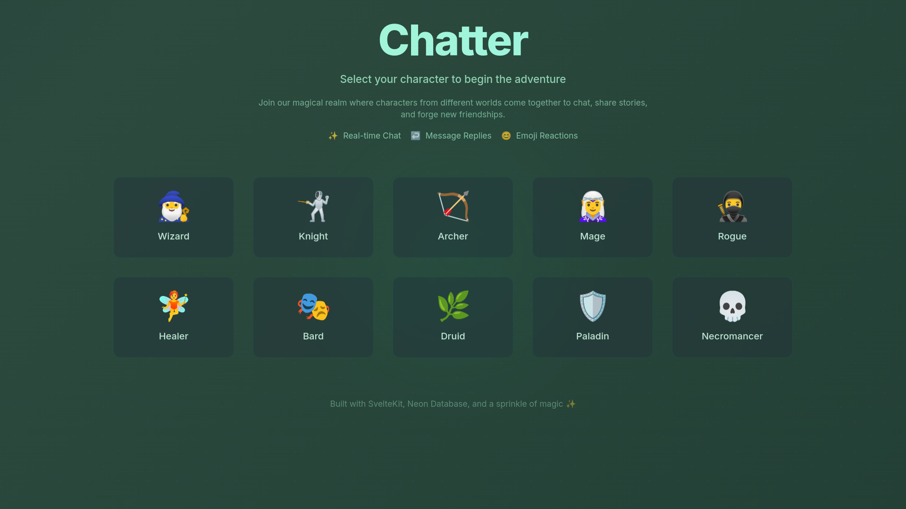

# Chatter

Chatter is a real-time chat application built with SvelteKit and Neon Database. It allows users to post messages, reply to messages, and react to messages with emojis.

## Live Demo

Check out the live demo [here](https://chatter.ifsvivek.tech)

## UI



## Features

- **Character Selection**: Choose from unique character avatars to represent yourself
- **Real-time Messaging**: Post and receive messages in real-time
- **Message Interactions**:
  - Reply to specific messages
  - React with emoji reactions
  - Delete your own messages
- **Modern UI**: Sleek design with animated backgrounds and transitions
- **Responsive**: Works seamlessly on mobile and desktop

## Technologies Used

- **Frontend**:
  - SvelteKit 5.0
  - TailwindCSS for styling
  - Svelte transitions and animations
- **Backend**:
  - Neon PostgreSQL Database
  - [@neondatabase/serverless](https://www.npmjs.com/package/@neondatabase/serverless) for database connectivity
- **Development**:
  - Vite for build tooling
  - Prettier for code formatting
  - ESLint for linting

## Getting Started

1. Clone the repository
2. Install dependencies:

```bash
npm install
```

3. Create a `.env` file with your Neon database URL:

```
POSTGRES_URL="your-neon-database-url"
```

4. Start the development server:

```bash
npm run dev
```
